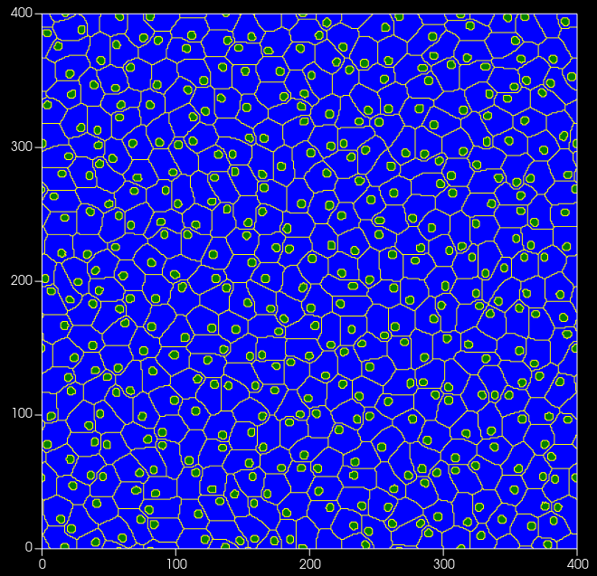

# CC3D Steppables

This project aims to be a repository of steppables to use for CompuCell3D
simulations. The steppables are written in Python and can be used in and
combined with any CC3D simulation.

## Getting started

Follow the [Installation](#installation) instructions to install the package in
your Compucell3D Python virtual environment.
Then, follow the [Usage](#usage) instructions to use the package in your own
CC3D simulation.

## Installation

Clone the repository and install the package using pip:

```bash
git clone https://gitlab.tue.nl/20235660/cc3d-steppables.git
pip install cc3d-steppables
```

## Usage

To use the steppables in your own CC3D simulation, import the package and use
`CompuCellSetup.register_steppable` to register the steppable in your simulation.
Below you can see the Python part of a CC3D simulation that uses the
`NucleusCompartmentCell` steppable to simulate a cell comprised of a nucleus
suspended in cytoplasm:

```python
from cc3d import CompuCellSetup
from cc3dslib.nucleus import NucleusCompartmentCell, NucleusCompartmentCellParams

nuc_params = NucleusCompartmentCellParams(
    box=(0, 0, 400, 400), nucleus_size_ratio=0.3, lambda_nuc=0.5
)
CompuCellSetup.register_steppable(NucleusCompartmentCell(params=nuc_params))
CompuCellSetup.run()
```

You can use several steppables in a single simulation. For example, you can
modify the above simulation to add an active force to each compartment cell:

```python
from cc3d import CompuCellSetup
from cc3dslib.nucleus import NucleusCompartmentCell, NucleusCompartmentCellParams
from cc3dslib import ActiveSwimmer, ActiveSwimmerParams

# cells with nucleus
nuc_params = NucleusCompartmentCellParams(
    box=(0, 0, 400, 400), nucleus_size_ratio=0.3, lambda_nuc=0.5
)
CompuCellSetup.register_steppable(NucleusCompartmentCell(params=nuc_params))

# active force
active_params = ActiveSwimmerParams(
    cell_size=nuc_params.cell_size, d_theta=0.1, force_magnitude=1.0
)
CompuCellSetup.register_steppable(ActiveSwimmer(params=active_params))

CompuCellSetup.run()
```

**Note:** Some of the steppables require specific plug-ins to be enabled in the
XML definition files of the CC3D simulation. For example, the
`NucleusCompartmentCell` steppable requires there to be two cell types
("cytoplasm" and "nucleus"). This can be achieved by adding the following lines
to the XML definition file:

```xml
<Plugin Name="CellType">
    <CellType TypeId="0" TypeName="cytoplasm"/>
    <CellType TypeId="1" TypeName="nucleus"/>
</Plugin>
```

The required plug-ins are listed in the documentation of each steppable.

Below you can see a screenshot of the simulation resulting from the snippet
above:



## Contributing
Contributions via merge requests are always welcome. If you encounter an issue
and don't have the time to fix it, please open an issue and describe the
problem. If you have a question, please open an issue and describe the problem.

## Authors and acknowledgment
Many of the steppables in this repository are based on the work of Quirine Braat and P. M. C. Wielstra.

## License

TBA

## Project status
This project is in active development, so expect changes to the API and the feature set.
